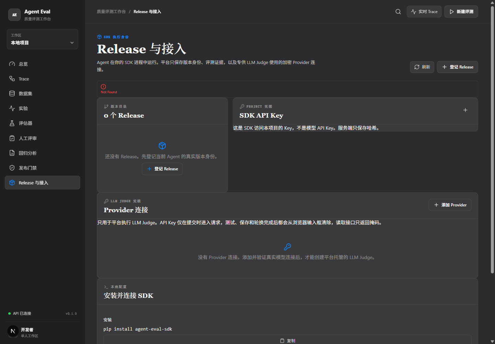
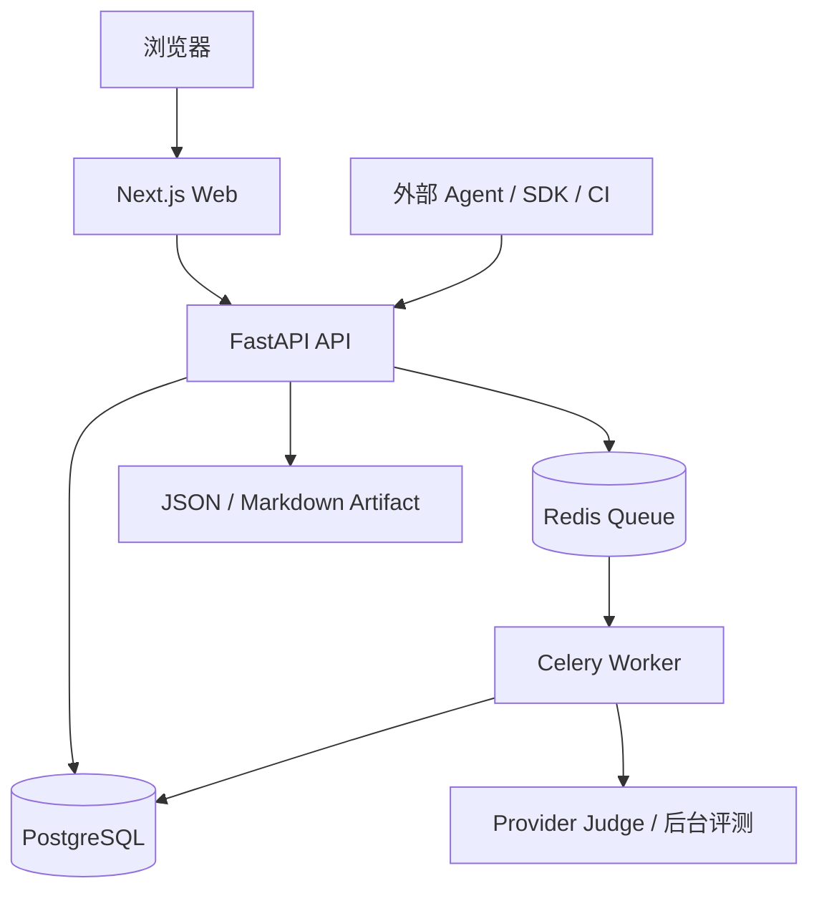
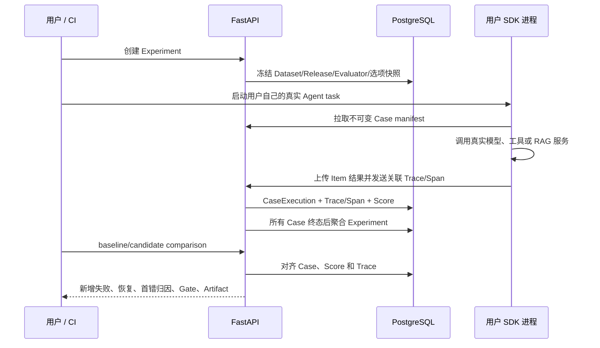

# Agent Eval Workbench

面向已经上线的 **RAG、Tool 与 Custom Agent** 的自托管质量评测平台。平台保存真实 Agent 的 Trace、Dataset、Experiment 与 Score，并通过 baseline/candidate 对比、首错归因与 Release Gate 支撑回归分析与发布决策，让团队在发布新版本前就知道它是否比旧版本差。

> 项目状态：核心闭环（Dataset → Evaluator → Release → Experiment → Trace → Score → Comparison → Gate）已完成开发与真实 DeepSeek 端到端验收，当前进入功能完善与上线前打磨阶段。

## 核心功能

### 1. Agent 接入

- 面向已经存在的 Agent：会检索知识库的 RAG Agent、会调用订单工具的 Tool Agent，或返回业务 JSON 的 Custom Agent。
- Agent 在用户自己的 Python 进程中运行，使用用户自己的模型 Key 和业务依赖；平台不托管 Prompt Agent、不执行上传源码、也不保存业务模型 Key。
- 通过 Python SDK 把真实 Agent 函数作为 `task` 运行并上传结果，平台只做版本管理、状态流转、证据校验与评分。

### 2. Trace 追踪

- 支持三种摄入格式：Canonical JSON、OpenInference-shaped JSON、OTLP HTTP JSON，另支持 Remote Upload 与签名 Remote Trigger。
- 完整 Span 树（LLM / Retriever / Tool / Tool Result），持久化前做脱敏与幂等检查，并按请求体大小限流。
- 如果 Agent 使用 OpenInference 或 OpenTelemetry instrumentor，SDK 会自动保留其子 Span，实现跨框架的步骤关联。

### 3. Dataset 与不可变版本

- UI/API 创建数据集，支持 CSV、JSON、JSONL 导入，导入前先预览再提交。
- 每个 Case 可声明期望工具调用、期望状态与元数据断言。
- 提交后形成**不可变 Version**；修改数据集不会影响已经运行的 Experiment，因为 Experiment 会保存自己的 manifest 快照。

### 4. Experiment 与评测器

- Experiment 固定 Dataset Version、Agent Release、Evaluator Version 与执行参数，保证结果可复现。
- 确定性评测器覆盖任务成功、Schema、工具选择/参数、延迟、Token、成本等指标。
- 已验证 OpenAI-compatible 平台托管的 LLM Judge，用于需要语义判断的场景。

### 5. 回归诊断与首错归因

- 同一 Dataset Version 上比较 baseline 与 candidate，按 Case 对齐两次实验。
- 报告指标改善/退化、新增失败、恢复成功，以及 Tool 轨迹的**第一个可证据分歧点**。
- 无法判断时给出 `INDETERMINATE`，不伪造结论。

### 6. Release Gate

- YAML Gate 输出 `PASS / WARNING / BLOCK / INCOMPLETE / INDETERMINATE` 五种状态。
- Gate 只读取持久化 Score、Comparison 与证据状态，可作为 CI 部署闸门；缺少证据不会默认通过。

### 7. 多用户与权限

- JWT 登录（HS256，默认 7 天过期）与 Project API Key（`aek_` 前缀，只存 HMAC 哈希）双通道鉴权。
- 多用户复用 project_id 做数据隔离，每用户映射专属私有 project；成员支持 admin/member 角色，停用即失效。
- 生产环境强制校验密钥强度，拒绝弱默认密钥启动。

## 界面截图

<table>
  <tr>
    <td align="center"><strong>中文 Trace-first 工作台</strong><br></td>
  </tr>
</table>

## 系统架构



- Web 只负责交互和展示，不直接访问数据库。
- API 负责认证、合同校验、Project 隔离、版本快照、查询和任务投递。
- Redis/Celery 不执行用户 Agent，只执行平台托管的 Provider Judge、评分聚合和后台任务；每个真实 Agent Case 仍在用户 SDK 进程或用户自己的 Remote Runtime 中执行。
- PostgreSQL 保存可长期查询的 Trace、Dataset、Experiment、Score 与版本关系。

## 核心业务流程

### 一次 SDK Experiment 的数据流



平台 API 是控制平面，负责版本、状态、权限和查询；用户进程是执行平面，负责调用真实模型和工具。两者通过 Project API Key 通信。

## 项目结构

```text
apps/web/       Next.js 中文工作台
apps/api/       FastAPI 路由、合同、持久化与诊断
apps/worker/    Celery 基础 Worker；旧 HTTP 路径仅作迁移兼容
infra/          Docker Compose 单机拓扑
migrations/     Alembic 数据库迁移
packages/       OpenAPI/TypeScript 合同
sdk/python/     可独立安装的 Python SDK
tests/          单元、集成、fixture 与 Playwright E2E
docs/           使用、架构、协议、运维和迁移文档
```

## API 入口

所有业务接口前缀为 `/projects/{project_id}`，通过 `Authorization: Bearer <jwt>`（浏览器）或 `X-Project-Key`（SDK/CI）鉴权；登录与成员管理接口前缀为 `/auth`。

| 模块 | 主要接口 |
| --- | --- |
| 健康检查 | `GET /health`、`GET /ready` |
| 鉴权与成员 | `/auth/*`（登录、成员管理） |
| 项目密钥 | `GET/POST /projects/{project_id}/api-keys` |
| Dataset | `/projects/{project_id}/datasets` |
| Evaluator | `/projects/{project_id}/evaluators` |
| Agent Release | `/projects/{project_id}/agent-releases` |
| Experiment / Run | `/projects/{project_id}/experiments`、`/projects/{project_id}/runs` |
| Trace | `/projects/{project_id}/traces`、`.../traces/ingest`、`.../traces/otlp` |
| 对比 | `/projects/{project_id}/comparisons` |
| 报告 | `/projects/{project_id}/reports` |
| 回归 Gate | `/projects/{project_id}/runs`（Gate 策略） |
| 远程触发 | `/projects/{project_id}/datasets/{dataset_id}/remote-trigger` |

## 本地运行

要求 Docker Desktop 与 Docker Compose v2：

```powershell
if (!(Test-Path .env)) { Copy-Item .env.example .env }
docker compose --env-file .env -f infra/docker-compose.yml up -d --build --wait
docker compose --env-file .env -f infra/docker-compose.yml ps
```

- Web 工作台：<http://127.0.0.1:3000>
- API 文档：`.env` 中 `AGENT_EVAL_API_PORT`，例如 `18080` 时访问 <http://127.0.0.1:18080/docs>

Compose 只启动 Web、API、Worker、PostgreSQL 与 Redis，不启动内置 Agent、Seeder 或固定回归 Demo。`.env` 仅用于本地，GitHub 只提交 `.env.example`。

### 安装 SDK

```powershell
pip install -e .\sdk\python
python -c "import agent_eval; print(agent_eval.__version__)"
```

最小 SDK 结构如下，`run_agent` 必须由用户自己实现并使用真实模型与工具：

```python
from agent_eval import Client, ExperimentRunner, TaskResult
from my_agent import run_agent

client = Client(
    base_url="http://127.0.0.1:8000",
    project_id="default-project",
    api_key="project-api-key",
)
dataset = client.get_dataset("dataset-id", version_id="dataset-version-id")
release = client.get_release("agent-release-id")

def task(case):
    answer, usage = run_agent(case.input)  # 用户自己的真实模型/工具调用
    return TaskResult(output=answer, usage=usage)

result = ExperimentRunner(client).run(
    dataset=dataset,
    task=task,
    release=release,
    evaluator_version_ids=["evaluator-version-id"],
    name="tool-agent candidate",
    evidence_policy="tool_trajectory_required",
)
print(result.experiment.id, result.experiment.status)
```

平台不会因为没有用户 Agent 就生成成功率、Trace、Score 或 Experiment 假数据；没有真实模型调用和完整证据时，结果会失败或为 `INCOMPLETE`。

## 测试与质量门禁

```powershell
pip install -e ".[dev]"
python -m pytest tests/unit tests/integration sdk/python/tests
python -m ruff check apps/api apps/worker sdk/python tests
python scripts/check_wheel_consistency.py
python scripts/check_migrations_roundtrip.py

Push-Location apps/web
npm ci
npm run typecheck
npm run build
Pop-Location
```

真实 Provider/Agent 验收不会在普通 CI 中隐式执行，需要在未跟踪 `.env` 中配置真实凭据：

```powershell
python tests/live/provider_preflight.py
python tests/live/run_tool_acceptance.py
python tests/live/run_rag_evaluation_acceptance.py
```

## 安全边界

- `.env`、数据库、日志、构建缓存和本地 Artifact 被 Git 忽略，只提交 `.env.example`。
- Project API Key 只保存哈希；Trace 在持久化和返回前脱敏。
- 业务 Agent 的模型 Key 留在用户自己的 Agent 进程中。
- 平台 Worker 不在 MVP 中逐 Case 调用 Agent `/run`；旧 HTTP 适配器仅供 V1.2 迁移。
- 所有 Score、Comparison 和 Gate 都来自持久化真实证据，缺少证据不会默认通过。

## 相关文档

- [零基础使用指南](docs/usage.md)
- [架构与数据流](docs/architecture.md)
- [参考产品、架构来源与边界](docs/reference-comparison.md)
- [外部协议](docs/external-protocols.md)
- [Trace 接入范围](docs/trace-ingestion.md)
- [单机部署与运维](docs/operations.md)
- [真实 Agent 测试指南](docs/real-agent-test-guide.md)
- [真实 Agent 验收记录](docs/real-acceptance-log-20260914.md)
