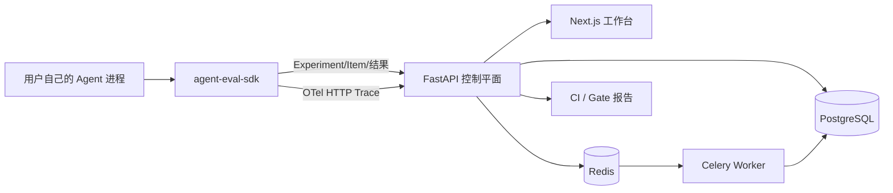

# Agent Eval Workbench

面向已经运行的 **RAG、Tool 与 Custom Agent** 的自托管质量平台。平台保存真实 Agent 的 Trace、Dataset、Experiment 和 Score，并用 baseline/candidate 比较、首错归因与 Release Gate 支持回归分析。

> 平台不托管 Prompt Agent，不执行用户上传的 Agent 源码，也不保存业务 Agent 的模型 Key。MVP 通过 Python SDK 在用户自己的进程中运行真实 Agent。

[](https://www.python.org/)
[](https://nextjs.org/)
[](https://docs.docker.com/compose/)

## 产品预览

中文 Trace-first 工作台展示 Project 中已经上报的真实 Trace、Dataset、Experiment、失败样本与 Gate 状态：


核心闭环：

```text
用户 Agent -> SDK/OTel Trace -> Dataset Case -> Experiment
          -> Score -> baseline/candidate -> 首错归因 -> Release Gate
```

## 核心能力

| 能力 | 说明 |
| --- | --- |
| Agent 接入 | 用户在自己的 Python 进程中调用真实 Tool/RAG/Custom Agent；SDK 不读取业务模型 Key |
| Trace | Canonical JSON、OpenInference-shaped JSON、OTLP HTTP JSON；Span 树、幂等、限流和脱敏 |
| Dataset | UI/API 创建，支持 CSV/JSON/JSONL 预览导入和不可变 Version |
| Experiment | 固定 Dataset Version、Agent Release、Evaluator Version 和执行参数 |
| Evaluator | 任务成功、Schema、工具选择/参数、延迟、Token、成本等确定性指标 |
| 回归诊断 | 同一 Dataset Version 上比较 baseline/candidate，报告新增失败、恢复和首个分歧 |
| 发布决策 | YAML Gate 输出 `PASS/WARNING/BLOCK/INCOMPLETE/INDETERMINATE` |
| 工程交付 | FastAPI、PostgreSQL、Redis/Celery、Next.js、OpenAPI、Alembic、pytest、Playwright |

## 架构



一次 SDK Experiment 的数据流：

```text
1. 页面或 SDK 固定 Dataset Version、Agent Release、Evaluator Version
2. SDK 从 API 读取不可变 Case manifest
3. SDK 在用户进程调用用户自己的真实 Agent
4. SDK 为每个 Case 建立根 Trace，并保留 Agent/LLM/Tool 子 Span
5. SDK 上传 Item 结果和 Trace，API 校验证据并持久化
6. API 根据真实输出运行确定性 Evaluator，生成 Score 和聚合指标
7. 第二个 Release 使用同一 Dataset Version 运行
8. Comparison、Attribution 和 Gate 读取持久化证据并给出结果
```

## 技术栈

| 层 | 技术 | 作用 |
| --- | --- | --- |
| Web | Next.js、React、TypeScript、Recharts、Lucide | 中文工作台 |
| API | Python 3.12、FastAPI、Pydantic、HTTPX | 合同、鉴权、持久化 API |
| 数据 | PostgreSQL、SQLAlchemy、Alembic | 版本、运行记录和证据 |
| 异步 | Redis、Celery | 执行平台托管 Provider Judge、评分聚合和后台任务；Agent 本身仍由 SDK/用户运行器执行 |
| 观测 | OpenTelemetry、OpenInference 语义字段 | 关联真实 Agent 轨迹 |
| 交付 | Docker Compose、OpenAPI、GitHub Actions | 单机部署和 CI |
| 测试 | pytest、Playwright、Ruff、mypy | 单元、集成、浏览器和静态检查 |

## 单机运行

要求 Docker Desktop 与 Docker Compose v2：

```powershell
if (!(Test-Path .env)) { Copy-Item .env.example .env }
docker compose -f infra/docker-compose.yml up -d --build --wait
docker compose -f infra/docker-compose.yml ps
```

打开 Web：<http://127.0.0.1:3000>。API 文档地址取决于 `.env` 中的 `AGENT_EVAL_API_PORT`，例如端口为 `18080` 时访问 <http://127.0.0.1:18080/docs>；未设置时使用 Compose 默认端口 `8000`。

如果宿主机端口已被其他项目占用，在未跟踪的 `.env` 中同时修改宿主端口和浏览器访问的 API 地址，例如：

```dotenv
AGENT_EVAL_WEB_PORT=13000
AGENT_EVAL_API_PORT=18080
NEXT_PUBLIC_API_URL=http://127.0.0.1:18080
AGENT_EVAL_BASE_URL=http://127.0.0.1:18080
```

修改 `NEXT_PUBLIC_API_URL` 后需要重新执行带 `--build` 的启动命令，因为该值会在 Next.js 构建时写入浏览器代码。

Compose 只启动 Web、API、Worker、PostgreSQL 和 Redis，不启动内置 Agent、Seeder 或固定回归 Demo。`.env` 仅用于本地，GitHub 只提交 `.env.example`。

## MVP 使用方式

1. 在 Dataset 页面创建或导入测试集，提交后选择固定 Version。
2. 在 Agent Release 页面登记 Agent 的版本身份，例如 Git SHA 或镜像摘要；这里不填写 Agent URL 或模型 Key。
3. 在 Evaluator 页面创建确定性评测规则。
4. 在 Experiment 页面选择 Dataset Version、Release 和 Evaluator，创建 `sdk_task` Experiment。
5. 在用户自己的 Agent 项目中安装本仓库的 `sdk/python` SDK，调用 `ExperimentRunner.run(..., task=真实Agent函数)`。
6. 返回工作台查看 Item、Trace、Span、Score、Comparison 和 Gate。

从仓库根目录安装并确认 SDK 可导入：

```powershell
pip install -e .\sdk\python
python -c "import agent_eval; print(agent_eval.__version__)"
```

最小 SDK 结构如下，`run_agent` 必须由用户自己实现并使用真实模型与工具：

```python
from agent_eval import Client, ExperimentRunner
from my_agent import run_agent

client = Client()
dataset = client.get_dataset("dataset-id", version_id="dataset-version-id")
release = client.get_release("agent-release-id")

result = ExperimentRunner(client).run(
    dataset=dataset,
    task=run_agent,
    release=release,
    evaluator_version_ids=["evaluator-version-id"],
    name="tool-agent candidate",
    evidence_policy="tool_trajectory_required",
)
print(result.experiment.id, result.experiment.status)
```

平台不会因为没有用户 Agent 就生成成功率、Trace、Score 或 Experiment 假数据。没有真实模型调用和完整证据时，结果会失败或为 `INCOMPLETE`。

## 项目结构

```text
apps/web/       Next.js 中文工作台
apps/api/       FastAPI 路由、合同、持久化与诊断
apps/worker/    Celery 基础 Worker；旧 HTTP 路径仅作迁移兼容
infra/          Docker Compose 单机拓扑
migrations/     Alembic 数据库迁移
packages/       OpenAPI/TypeScript 合同
sdk/python/     可独立安装的 Python SDK
tests/          单元、集成、fixture 与 Playwright E2E
docs/           使用、架构、协议、运维和迁移文档
```

## 开发验证

```powershell
pip install -e ".[dev]"
python -m pytest tests/unit tests/integration sdk/python/tests
python -m ruff check apps/api apps/worker sdk/python tests

Push-Location apps/web
npm ci
npm run typecheck
npm run build
Pop-Location
```

## 安全边界

- `.env`、数据库、日志、构建缓存和本地 Artifact 被 Git 忽略，只提交 `.env.example`。
- Project API Key 只保存哈希；Trace 在持久化和返回前脱敏。
- 业务 Agent 的模型 Key 留在用户自己的 Agent 进程中。
- 平台 Worker 不在 MVP 中逐 Case 调用 Agent `/run`；旧 HTTP 适配器仅供 V1.2 迁移。
- 所有 Score、Comparison 和 Gate 都来自持久化真实证据，缺少证据不会默认通过。

## 文档

- [零基础使用指南](docs/usage.md)
- [架构与数据流](docs/architecture.md)
- [参考产品、架构来源与边界](docs/reference-comparison.md)
- [外部协议](docs/external-protocols.md)
- [Trace 接入范围](docs/trace-ingestion.md)
- [单机部署与运维](docs/operations.md)
