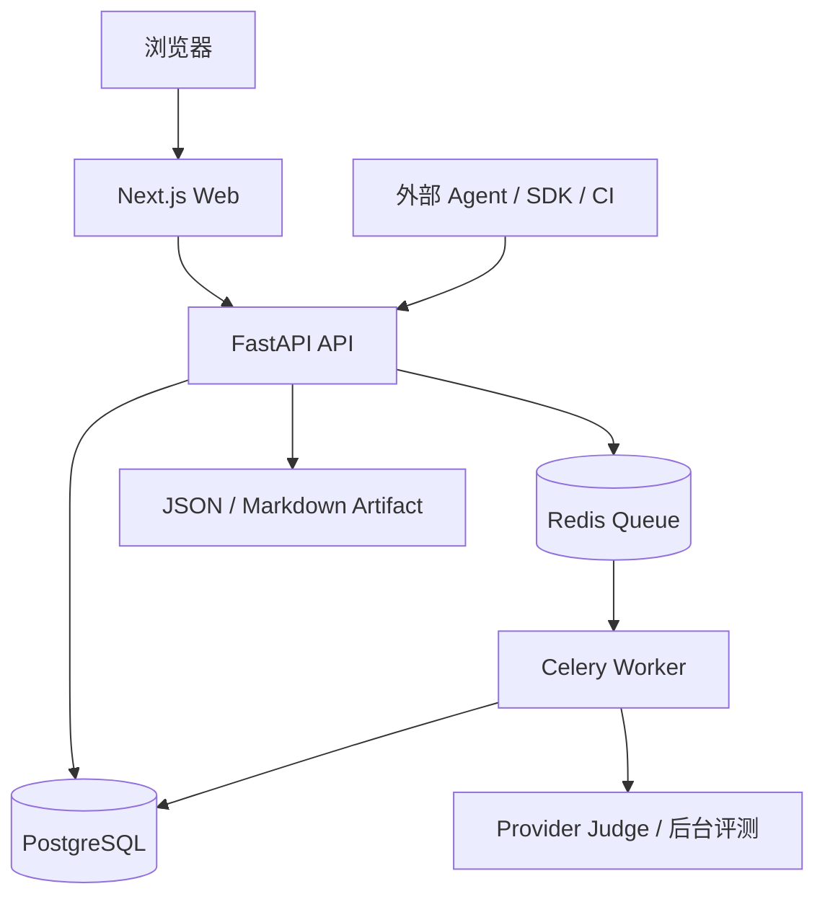
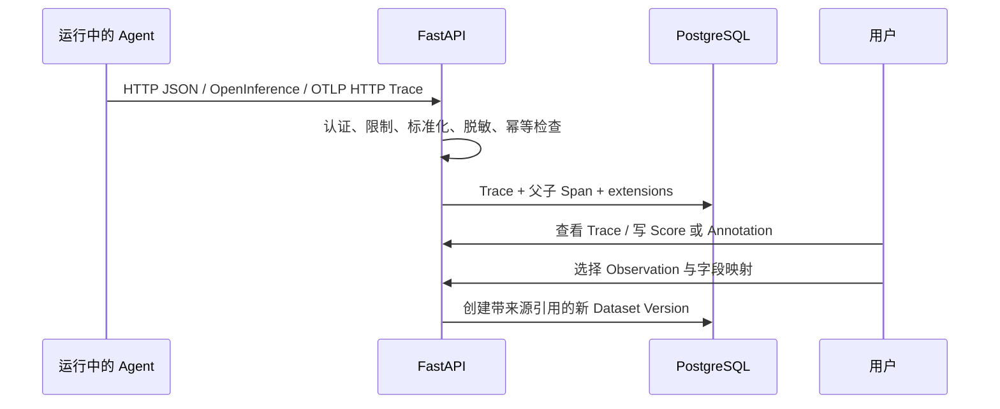
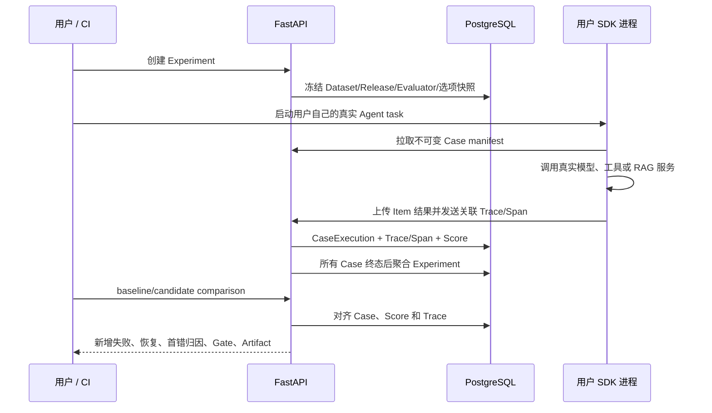
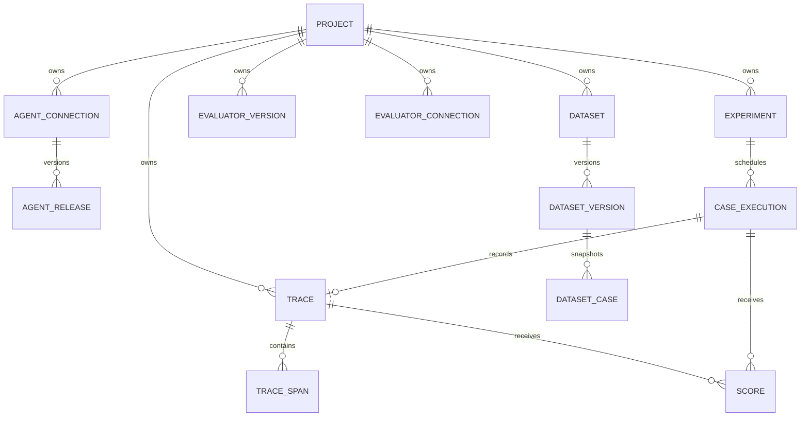

# 架构与数据流

本文说明系统自身的结构和数据流。各项工作流分别借鉴了哪些公开产品、做了什么适配，以及哪些范围明确不支持，见 [参考产品、架构来源与边界](reference-comparison.md)。

## 运行组件



- Web 只负责交互和展示，不直接访问数据库。
- API 负责认证、合同校验、Project 隔离、版本快照、查询和任务投递。
- Redis/Celery 不执行用户 Agent；它们执行平台托管 Provider Judge、评分聚合和其他后台处理。每个真实 Agent Case 仍在用户 SDK 或用户自己的 Remote Runtime 中执行。
- PostgreSQL 保存可长期查询的 Trace、Dataset、Experiment、Score 和版本关系。Redis 不是事实数据库。
- 用户 Agent 由用户运行，平台不执行上传源码、不调用 per-Case Agent `/run`，也不接收业务 Agent 的模型 Key。当前支持 Python SDK、独立 OTel/OpenInference、语言无关 Remote Upload，以及由签名 Webhook 触发已部署 Agent 的 Remote Trigger。

## 两条数据流

### 线上可观测闭环



### 离线回归闭环



## 数据模型



`Project` 是数据与凭据边界。单机版自动使用 `default-project`，但数据库中的所有核心对象仍保留 `project_id`，避免未来多项目演进时破坏数据。

`Experiment` 创建时复制以下不可变快照：Dataset Version、Agent Release、Evaluator Version 集合、可选外部 Judge Connection 身份、执行参数和 baseline 引用。因此后来修改连接或 Dataset 不会改变历史结果。

## Canonical Trace

所有接入适配器最终转换为：

```text
Trace(trace_id, project_id, source, run_id?, case_id?, status, extensions)
  -> Span(span_id, parent_span_id, kind, status, timestamps,
          input, output, error, usage, cost, attributes, extensions)
```

Span kind 支持 `agent`、`prompt`、`llm`、`tool`、`tool_result`、`retrieval`、`guardrail`、`evaluator`。这里的 `prompt` 只是外部 Trace 中的步骤类型，不代表平台支持 Prompt Agent 或 Prompt Runner。未知厂商字段保留在 `extensions`，避免适配时丢失证据。

## 评测与发布决策

确定性规则优先用于阻断 Gate，因为同一输入会得到可复现结果。外部 LLM Judge 是补充证据，调用失败会形成 `missing/error`，不会变成通过。人工 Annotation 追加历史，不覆盖自动 Score。

回归比较只接受同一 Dataset Version，并检查同名指标的 Evaluator Version 是否兼容。对新增失败，系统按 Trace 顺序寻找首个可观察分歧：工具选择、参数、执行、检索、最终答案、格式、超时、成本/延迟；证据不足时返回 `indeterminate`。

Gate 读取版本化 YAML，输出 `PASS`、`WARNING`、`BLOCK`、`INCOMPLETE` 或 `INDETERMINATE`。JSON 用于 CI 判断，Markdown 用于人阅读，两者都保留 Case、Run、Trace 和首错引用。

## 关键技术取舍

- PostgreSQL 而非只用 JSON 文件：版本关系、Project 隔离和历史证据需要事务与约束。
- Redis + Celery 而非在 API 请求内执行：Agent 调用可能慢或失败，异步任务避免拖死页面，并实现 Case 隔离、并发和重试。
- JSON 列 + 关系字段：不断变化的 Agent 输入输出放 JSON；ID、版本、状态和外键保持关系结构。
- 用户进程 SDK 而非平台执行源码：降低任意代码执行风险，同时让 Agent 的模型 Key、业务依赖和运行环境留在用户侧。
- 多维 Score 而非总分：不同 Agent 的任务成功、工具、RAG、成本无法诚实压成同一固定权重。
- 单机 Docker Compose 而非 Kubernetes：满足个人项目和单服务器部署，同时完整展示数据库、队列、Worker 和 Web 的工程协作。
