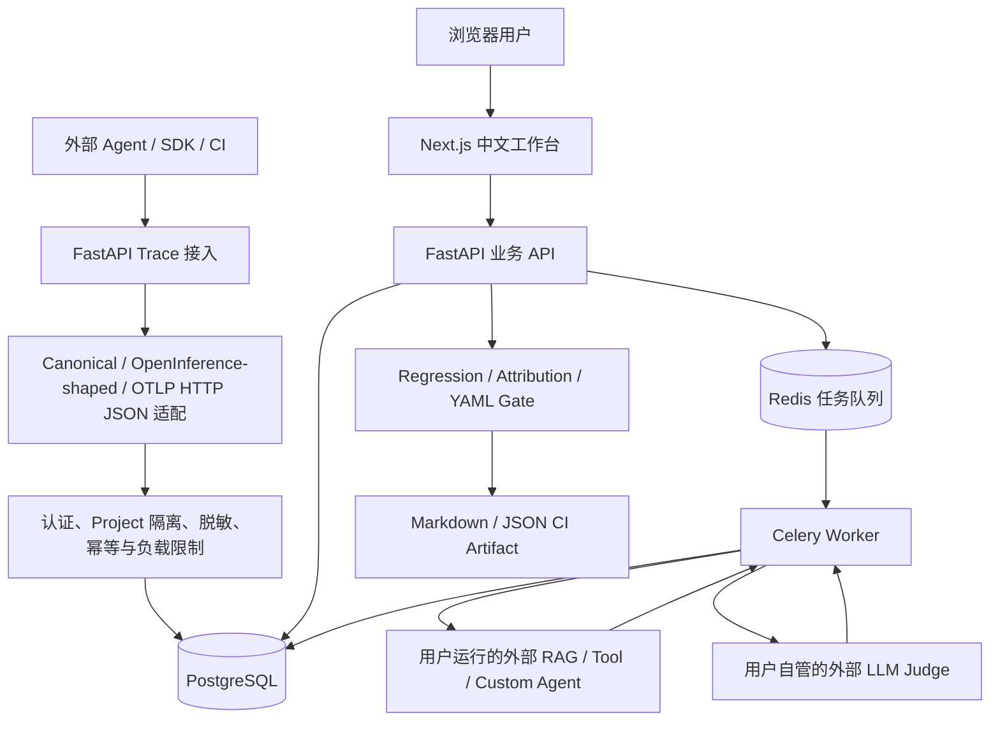
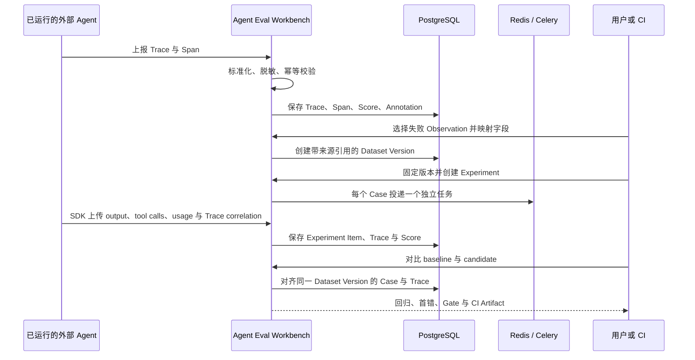

# 参考产品、架构来源与边界

本文记录 Agent Eval Workbench 的设计依据，帮助读者区分三件事：参考产品已经公开证明的工作流、本项目为了单机自托管场景做的适配，以及本项目明确不做的范围。

调研与链接复核日期：**2026-09-10**。

> “借鉴”只表示采用公开的产品工作流或开放标准思想。本项目是独立实现，没有复制 Phoenix、Langfuse 或 TrajectIQ 的源码、界面、商标和私有协议，也不宣称与它们的 API、SDK、数据库或全部遥测字段兼容。

## 本项目最终定位

Agent Eval Workbench 面向已经运行的 RAG、Tool 和 Custom Agent，提供一条从真实运行证据到发布决策的自托管链路：

```text
Trace 可观测证据
  -> 线上 Score / Annotation
  -> 失败 Observation 沉淀为 Dataset Case
  -> 固定 Dataset Version、Agent Release、Evaluator Version
  -> baseline / candidate Experiment
  -> 新增失败、恢复成功与首错归因
  -> YAML Release Gate
  -> CI 可读取的 Markdown / JSON
```

它不是通用 APM，也不是 Prompt 托管平台。项目的重点是：让 Agent 版本变化产生的质量结论可复现、可解释、可阻断。

## 运行架构



这里的 Phoenix/Langfuse 影响主要在左半部分的 Trace、Dataset、Experiment 质量闭环；TrajectIQ 影响主要在右半部分的版本回归、首错归因和发布门禁。Redis/Celery、固定快照及整套 Web/API/数据库实现都是本项目自己的工程适配。旧 HTTP `/run` 适配器仅保留在迁移兼容代码中，不属于当前 MVP 生产路径。

## 两条数据流如何汇合



线上链路从真实 Trace 开始，解决“线上出过的问题怎样变成测试题”；离线链路从版本化 Dataset 开始，解决“新 Agent Release 是否比旧版本退化”。两条链路通过带 `source_trace_id` / `source_span_id` 的 Dataset Case 汇合。

## 有来源的产品对比

| 主题 | 公开来源能证明什么 | 本项目怎样处理 | 分类 |
| --- | --- | --- | --- |
| Phoenix Trace | Phoenix 使用 OpenTelemetry 接收 Trace，并把 Project、Trace/Span、Annotation、延迟、Token 和错误作为可观测对象。 | 保留 Project 范围的 Trace/Span 证据；提供 Canonical JSON、OpenInference-shaped JSON 与 OTLP HTTP JSON 入口。 | 借鉴工作流，协议范围适配 |
| Phoenix Dataset / Experiment | Phoenix Dataset 包含输入和可选 reference；数据可来自生产、预发布、评测或手工；Experiment 用 Task 和 Evaluator 在样本上运行并比较结果。 | 使用 `input`、`expected_output`、`metadata` 核心字段，并增加 RAG/Tool 必需字段；外部 Agent endpoint 充当 Task。 | 借鉴工作流，外部 Agent 适配 |
| Langfuse Trace-first | Langfuse 的可观测文档从 first trace 开始，Trace 包含 LLM、检索、工具和自定义逻辑，并可关联 Score。 | 空项目首先引导接入 Trace；Trace 详情显示 Span、Score、Annotation 和脱敏状态。 | 借鉴工作流 |
| Langfuse 生产数据转 Dataset | Langfuse 支持把生产 Trace 的 Observation 加入 Dataset，记录 source trace/observation，并支持字段映射。 | 用户从 Trace 选择 Span，显式映射 input、expected output、metadata 和 Agent 专用字段，同时保存来源引用。 | 借鉴工作流，字段模型适配 |
| Langfuse Dataset 版本 | 当前文档说明 item 的 add/update/delete/archive 会形成新版本，并可选择特定版本运行 Experiment。 | 每次 Case 变化创建不可变 Dataset Version；Experiment 创建时把版本与 Case 快照固定下来。 | 相同目标，独立快照实现 |
| Langfuse Experiment | SDK Experiment 接收 dataset/data、task、item evaluator 与 run evaluator；任务和 evaluator 可异步并限制并发。 | 每个 Case 作为 Celery 独立任务执行；记录逐 Case Score，再聚合 Experiment 指标，并限制并发、超时和重试。 | 借鉴执行模型，队列化适配 |
| TrajectIQ 回归 | 固定提交的架构与源码实现 baseline/candidate 版本比较、任务级回归和指标差值。 | 只比较相同 Dataset Version 且 evaluator identity 兼容的 Experiment，同时报告新增失败、恢复和缺失证据。 | 借鉴工作流，增加可比性约束 |
| TrajectIQ 首错 | `locate_first_error` 对齐轨迹并寻找第一个确定性差异；架构文档将其称为 first divergent step。 | 对齐 Trace Span，保守分类为工具选择、参数、执行、检索、答案、格式、超时、成本/延迟或 `indeterminate`。 | 借鉴算法思想，扩展分类 |
| TrajectIQ Gate / CI | 仓库包含 `release-gate.yaml`、Gate CLI 和 GitHub Actions；工作流把 Markdown 写入 Summary、上传 Artifact 并更新 PR 评论。 | 版本化 YAML policy 输出 `PASS/WARNING/BLOCK/INCOMPLETE/INDETERMINATE`，生成关联 Case/Trace/首错证据的 JSON 与 Markdown。 | 借鉴工作流，fail-closed 适配 |

## 来源

### Phoenix 官方来源

- [Tracing overview](https://arize.com/docs/phoenix/tracing/llm-traces)：说明 Phoenix 通过 OpenTelemetry 接收 Trace，Trace 覆盖检索、模型、工具等步骤，并提供 Project、Annotation 和 Metrics。
- [Datasets & Experiments overview](https://arize.com/docs/phoenix/datasets-and-experiments/overview-datasets)：说明 Dataset 的 `inputs` / 可选 `reference`、多种数据来源、Task、Evaluator 与 Experiment 比较用途。
- [Phoenix GitHub](https://github.com/Arize-ai/phoenix)：用于确认 Phoenix 是开源的 AI observability/evaluation 项目。
- [OpenInference GitHub](https://github.com/Arize-ai/openinference)：用于确认 Phoenix 相关的 AI 可观测语义约定来源。

### Langfuse 官方来源

- [Observability overview](https://langfuse.com/docs/observability/overview)：说明 Trace-first 的入门方式、Trace 中的 LLM/检索/工具步骤和 Score 使用方式。
- [Datasets](https://langfuse.com/docs/evaluation/experiments/datasets)：说明 UI/SDK/CSV 创建、从生产 Observation 创建、字段映射、Dataset item 版本及在特定版本上运行 Experiment。
- [Experiments data model](https://langfuse.com/docs/evaluation/experiments/data-model)：说明 Dataset、DatasetItem、DatasetRun、Trace、Observation 与 Score 的关系。
- [Experiments via SDK](https://langfuse.com/docs/evaluation/experiments/experiments-via-sdk)：说明 Task、逐项/整次 Evaluator、异步函数和并发限制。

### TrajectIQ 固定提交来源

以下链接固定到调研时检查的公开提交 `4740559d9dc022f69d8a6d6a5a8e4c9aaf5cf82c`，避免后续仓库变化使结论失去上下文：

- [ARCHITECTURE.md](https://github.com/yibo0210/TrajectIQ/blob/4740559d9dc022f69d8a6d6a5a8e4c9aaf5cf82c/ARCHITECTURE.md)：明确 Phoenix 与 TrajectIQ 的职责边界，以及版本比较、任务级回归、首错、Gate、CI Artifact 数据流。
- [regression.py](https://github.com/yibo0210/TrajectIQ/blob/4740559d9dc022f69d8a6d6a5a8e4c9aaf5cf82c/src/trajectiq/regression.py)：可核验 baseline/candidate 指标差值与任务回归实现。
- [attribution.py](https://github.com/yibo0210/TrajectIQ/blob/4740559d9dc022f69d8a6d6a5a8e4c9aaf5cf82c/src/trajectiq/attribution.py)：可核验 `locate_first_error` 的首个确定性轨迹差异逻辑。
- [release-gate.yaml](https://github.com/yibo0210/TrajectIQ/blob/4740559d9dc022f69d8a6d6a5a8e4c9aaf5cf82c/release-gate.yaml)：可核验声明式质量阈值。
- [release-gate.yml](https://github.com/yibo0210/TrajectIQ/blob/4740559d9dc022f69d8a6d6a5a8e4c9aaf5cf82c/.github/workflows/release-gate.yml)：可核验 GitHub Actions Summary、Artifact 和 PR 评论流程。

## 本项目的适配与优势

与参考产品相比，本项目没有追求功能数量，而是把一条可面试、可运行的 Agent 发布质量链路做完整：

1. **把观测与发布连接起来**：生产 Trace 不只用于查看，还能变成保留来源证据的回归 Case。
2. **显式冻结实验身份**：Dataset Version、Agent Release、Evaluator Version、Judge connection identity 与执行参数共同组成 Experiment 快照。
3. **结论不只是一行分数**：从新增失败进入 baseline/candidate Trace，定位首个可观察分歧；证据不足就返回 `indeterminate`。
4. **缺失证据不能通过**：Judge 超时、Score 缺失和 Case 未完成会形成 `INCOMPLETE`/`INDETERMINATE`，不会被当成 PASS。
5. **适合一台服务器自托管**：Next.js、FastAPI、PostgreSQL、Redis 和 Celery 由 Docker Compose 启动，同时保留真实的队列、迁移、协议和浏览器测试。

这些是本项目自己的产品组合与工程实现，不代表 Phoenix、Langfuse 或 TrajectIQ 缺少同类能力，也不是对三者优劣的完整评测。

## 刻意不做的范围

- 不提供 Prompt Agent、Prompt Runner、Prompt Playground、Prompt 托管或平台代管模型调用。
- 不保存 OpenAI、Anthropic 等模型供应商 API Key；LLM Judge 必须由用户通过外部 HTTP endpoint 自管。
- 不执行用户上传的 Python/JavaScript Agent 源码，只调用用户登记的外部 Agent 测试 endpoint。
- 不宣称完整兼容 Phoenix、Langfuse、OpenInference 或 OpenTelemetry；当前只支持文档明确列出的 JSON 字段映射与 OTLP HTTP JSON，不支持 OTLP gRPC。
- 不复刻 Phoenix/Langfuse 的 Sessions、Prompt Management、完整 Dashboard、全部 SDK/框架集成、服务端模型提供商和 SaaS 企业功能。
- 不复刻 TrajectIQ 的客户支持固定 Agent、36 条固定任务或独立 Dashboard；只采用可泛化的回归、归因和 Gate 工作流。
- 不做 Kubernetes、计费、完整 RBAC、多租户 SaaS 和万能总分；这些不属于当前单机自托管项目的验收范围。

## 阅读这些对比时的注意事项

参考产品会持续更新。例如，Langfuse 当前文档已经支持选择特定 Dataset Version 运行 Experiment；旧资料中“Experiment 总是使用最新版本”的说法已经过时。因此本文只陈述上述链接在调研日期可直接证明的事实，不把某个时点的缺失功能当作本项目的永久优势。
